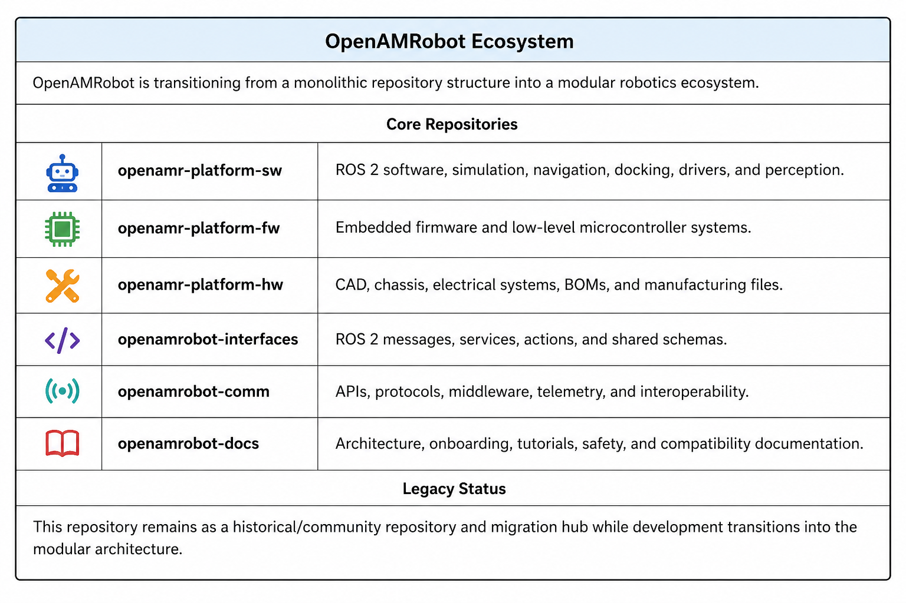

# OpenAMRobot

## Turn Domain Expertise into Robotic Skills by Demonstration

### The Programming Language of Robotics is Domain Expertise.

OpenAMRobot is an open-source Physical AI development platform that enables startups, researchers, universities, and domain experts to build, train, validate, and deploy robotic solutions without rebuilding the entire robotics stack.

We believe the future of robotics will not be built by robotics engineers alone.

It will be built by:

- Manufacturing experts
- Logistics specialists
- Healthcare professionals
- Researchers
- Entrepreneurs
- Innovators

People who understand problems and want to automate them.

OpenAMRobot provides the infrastructure that transforms domain expertise into robotic capabilities.

---

## Why OpenAMRobot?

Building a modern Physical AI system requires expertise across:

- Robotics
- AI
- Perception
- Teleoperation
- Data collection
- Simulation
- Training infrastructure
- Deployment

Most teams spend months assembling infrastructure before they can validate a single robotic application.

OpenAMRobot reduces this complexity by providing an integrated development platform for:

- Mobile manipulation
- Teleoperation
- Data collection
- Imitation learning
- Embodied AI research
- Human-in-the-loop training
- Robot skill development
- Real-world deployment

**The fastest path from business problem to robotic solution.**

---

## Robotics 3.0

### Software evolution

**Software 1.0**  
Write code

**Software 2.0**  
Train models

**Software 3.0**  
Describe outcomes

### Robotics evolution

**Robotics 1.0**  
Program robots

**Robotics 2.0**  
Train robots

**Robotics 3.0**  
Teach robots by demonstration

OpenAMRobot is building the platform for Robotics 3.0.

---

## How it works

Domain Expert  
↓  
Demonstrates Task  
↓  
OpenAMRobot Collects Data  
↓  
AI Learns Skill  
↓  
Robot Executes Task

OpenAMRobot connects hardware, software, AI, and deployment into a single workflow.

---

## What OpenAMRobot provides

### Reference hardware

- Autonomous mobile robot platform
- Dual-arm mobile manipulation
- Adjustable lift systems
- Modular sensor architecture
- Open hardware designs

### Software infrastructure

- ROS 2 ecosystem
- Navigation and autodocking
- Teleoperation interfaces
- Simulation environments
- Embedded firmware

### Physical AI infrastructure

- Demonstration data collection
- ROS bag recording
- Dataset generation
- Imitation learning pipelines
- Foundation model integration
- Policy training workflows
- Deployment infrastructure

---

## Who is OpenAMRobot for?

### Today

- Robotics startups
- Universities
- Research laboratories
- Corporate innovation teams
- Venture builders

### Tomorrow

- Manufacturing
- Logistics
- Healthcare
- Agriculture
- Service robotics

Our users build robots.

Their users deploy robots.

---

## Why OpenAMRobot matters

Physical AI is creating a new generation of robots that learn from demonstration, adapt to new tasks, and solve real-world problems.

Yet building a trainable robot still requires expertise across hardware, software, AI, teleoperation, data collection, training pipelines, simulation, deployment, and hardware integration.

OpenAMRobot reduces this complexity by providing an integrated platform that enables anyone with domain expertise to create robotic solutions.

The real value is not the robot itself.

The real value is how efficiently a robotic system can solve a business problem.

---

## Our vision

The next generation of creators will not just build software.

They will build robots.

OpenAMRobot enables anyone with domain expertise to create robotic solutions without becoming a robotics engineer.

**The Programming Language of Robotics is Domain Expertise.**

> [!IMPORTANT]
> ## OpenAMRobot Ecosystem
>
> OpenAMRobot is transitioning from a monolithic repository structure into a modular robotics ecosystem.
>
> 
>
> ### Core Repositories
>
> | Repository | Purpose |
> |---|---|
> | `openamr-platform-sw` | ROS 2 software, simulation, navigation, docking, drivers, perception, and robot bringup |
> | `openamr-platform-fw` | Embedded firmware, low-level microcontroller systems, motor interfaces, and hardware communication |
> | `openamr-platform-hw` | CAD, chassis, electrical systems, BOMs, manufacturing files, and mechatronics |
> | `openamrobot-interfaces` | ROS 2 messages, services, actions, shared schemas, and interface contracts |
> | `openamrobot-comm` | APIs, middleware, telemetry, transport protocols, interoperability, and fleet communication |
> | `openamrobot-ui` | Operator interfaces, dashboards, visualization tools, and user-facing applications |
> | `openamrobot-docs` | Architecture, onboarding, tutorials, safety, compatibility matrices, and contributor documentation |
>
> ### Future Expansion
>
> Planned future ecosystem areas include:
>
> - humanoid and dual-arm robotics
> - fleet management
> - cloud robotics
> - remote operation
> - AI-assisted autonomy
> - industrial integrations
> - educational platforms
>
> ### Legacy Status
>
> This repository remains as a historical/community repository and migration hub while development transitions into the modular architecture.

## Introduction

SMEs across multiple industries can significantly enhance their operations through the adoption of Collaborative Dual-Arm Autonomous Mobile Robots. 
In warehouses and distribution centers, such robots streamline goods movement and order fulfillment by combining autonomous navigation with dexterous dual-arm manipulation, enabling advanced G2P workflows and reducing manual handling. 
In manufacturing environments, they improve production efficiency by autonomously transporting materials between workstations and performing basic assembly or handling tasks. 
For last-mile logistics, including courier, express, parcel (CEP), and grocery delivery, dual-arm AMRs further boost operational efficiency by automating repetitive loading, sorting, and delivery operations.

Our project empowers you to build your own AMR using open-source designs and accessible manufacturing methods. This guide provides detailed drawings, 3D models, Bill of Materials (BOM), hardware architecture, navigation software, and user interface packages. Utilize straightforward manufacturing technologies to learn and integrate advanced automation seamlessly into your business operations.

## 💜 Support OpenAMRobot

Support open-source robotics, ROS 2 development, AI robotics education, and dual-arm mobile robot research.

### ⚡ Back the build — one-time, no strings

| Tier | What it says about you | Link |
|---|---|---|
| ⚡ **First Mover — €5** | You got here first, and you didn't overthink it. Your name goes on the backers wall — permanently — as one of the people who moved before it was obvious. Five euros, one good instinct. | <a href="https://buy.stripe.com/eVqcN5b99eeAaSd7WPgUM06" target="_blank" rel="noopener noreferrer">💳&nbsp;Back&nbsp;it&nbsp;→</a> |
| 🎯 **Sharpshooter — €25** | You spotted it early and called it. Name on the wall + a shareable "OpenAMRobot Backer" badge — proof you saw it coming while everyone else was still scrolling. | <a href="https://buy.stripe.com/4gMdR9ell1rO2lH90TgUM07" target="_blank" rel="noopener noreferrer">💳&nbsp;Back&nbsp;it&nbsp;→</a> |
| 🕶️ **Insider — €50** | You want in behind the curtain. Everything above + the backer-only build log and early files — every breakthrough, every faceplant, unfiltered. You see it before the internet does. | <a href="https://buy.stripe.com/eVq14nfpp4E0gcx2CvgUM08" target="_blank" rel="noopener noreferrer">💳&nbsp;Back&nbsp;it&nbsp;→</a> |
| 🔩 **Immortal — €100** | Your name goes on the actual robot. Physically. Forever. A machine will roll around carrying your name long after any of us remember why — and you'll have the photo to prove you were there. | <a href="https://buy.stripe.com/00w00jdhhb2o4tPfphgUM09" target="_blank" rel="noopener noreferrer">💳&nbsp;Back&nbsp;it&nbsp;→</a> |
| 🏆 **Founding Backer — €250** | Not a supporter — a co-author. Everything above + a personal thank-you in a build video. When this becomes something, you were one of the people who decided it would. | <a href="https://buy.stripe.com/28EeVdcdddawaSdeldgUM0a" target="_blank" rel="noopener noreferrer">💳&nbsp;Back&nbsp;it&nbsp;→</a> |

### 🔁 Monthly subscriptions — build it with us, every month

| Tier | What you get | Link |
|---|---|---|
| 😇 **Benefactor — €5/mo** | This month, officially not wasted. €5 to help build an open robot for everyone — cheaper than the coffee you'll forget you bought. Your name goes on the wall. History will remember you — well, me for sure. 🤖 | <a href="https://buy.stripe.com/9B6cN5dhh9Yk7G1cd5gUM05" target="_blank" rel="noopener noreferrer">💳&nbsp;Subscribe&nbsp;→</a> |
| ❤️ **Community — €19/mo** | You're in. Community access, project & roadmap updates, basic documentation, and community Q&A. (Private consultation not included.) | <a href="https://buy.stripe.com/6oUcN55OPc6s3pL4KDgUM00" target="_blank" rel="noopener noreferrer">💳&nbsp;Subscribe&nbsp;→</a> |
| 🔧 **Builder — €79/mo** | For the ones who actually build. Everything in Community + builder docs, monthly group Q&A, selected tutorials, early design updates, and discounts on digital packs. (Private consultation not included.) | <a href="https://buy.stripe.com/14A28r0uvdaw9O9eldgUM01" target="_blank" rel="noopener noreferrer">💳&nbsp;Subscribe&nbsp;→</a> |
| 🚀 **Pro Support — €299/mo** | Expert support for advanced builders, early founders, and small labs. Includes 1 private consulting call per month and up to 3 hours/month of technical guidance. | <a href="https://buy.stripe.com/dRm4gz4KLdaw6BX4KDgUM02" target="_blank" rel="noopener noreferrer">💳&nbsp;Subscribe&nbsp;→</a> |
| 🏢 **Startup Support — €750/mo** | For robotics startups and teams heading toward a prototype. Includes 2 private consulting calls per month, roadmap support, GitHub/documentation review, supplier review, and up to 6 hours/month. | <a href="https://buy.stripe.com/7sY8wPfpp8Ugf8t90TgUM03" target="_blank" rel="noopener noreferrer">💳&nbsp;Subscribe&nbsp;→</a> |
| 🔬 **Lab Support — €1,500/mo** | For universities, corporate labs, and training centers. Includes 4 private sessions per month, lab implementation support, architecture reviews, training-roadmap support, and up to 10 hours/month. | <a href="https://buy.stripe.com/eVq14ndhh2vSaSda4XgUM04" target="_blank" rel="noopener noreferrer">💳&nbsp;Subscribe&nbsp;→</a> |

**❤️ GitHub Sponsors:** <a href="https://github.com/sponsors/openAMRobot" target="_blank" rel="noopener noreferrer">🐙&nbsp;github.com/sponsors/openAMRobot&nbsp;→</a>

*Every contribution — €5 or €1,500 — literally builds this robot. No billion-dollar lab required. **You're not donating. You're building it.** 🤖*

## Key features

- **Navigation**: LIDAR/SLAM
- **Drive type**: Differential drive
- **Weight**: ~60 kg
- **Camera view**: 120 degrees
- **Speed**: 1500-2000 mm/s (unloaded), 1200-1500 mm/s (loaded)
- **Positioning accuracy**: ±20 mm
- **Dimensions**: 600x800 mm
- **Battery**: 24/48 V, 48-56 Ah, 8 hours life
- **Communication**: Wi-Fi (2.4/5 GHz)
- **Load capacity**: up to 150 kg
- **Operating temperature**: -10°C to +50°C
- **Charging**: Contact/wireless

## Design and manufacturing

Our design is optimized for manufacturability, requiring only basic technologies such as laser cutting, bending, turning (optional), and 3D printing (optional). Using mostly 2mm thick metal sheets, the design is robust yet simple to produce, allowing one person to build the robot in just one day if every part is ready.

Here is how the chassis design looks like:

### Mechanical design and assembly

1. **Downloadable resources**:
    - Production drawings, 3D models, STEP, and DXF files
    - Specification sheet, including all parts and assemblies, sensors, and fasteners
2. **Fabrication process**:
    - Discuss the drawings with a contractor for cutting and bending metal.
    - Assemble the chassis following the provided sequence.
3. **Assembly steps**:
    - The chassis design and the recommended assembly sequence are illustrated in the provided images.
    - Detailed steps for assembling the drive wheels and other components are included.

### Hardware and software integration

1. **Electronics block diagram**:
    - Main single-board computer (SBC)
    - Safety sensors (US, IR, bumper), RPI camera, and LiDAR
    - Controller Teensy board and firmware
    - BLDC motors, drivers, and encoders
    - Batteries, BMS, and wireless charger
    - On/Off switch and Emergency button

2. **Main components**:
    - **Raspberry Pi 5**: For main computing tasks.
    - **LIDAR**: For mapping and navigation.
    - **Sensors**: For obstacle detection and safety.
    - **BLDC motors and drivers**: For movement control.
    - **Battery system**: For power supply.
    - **Wireless charging**: For autonomous charging.

3. **Software setup**:
    - **Linorobot**: Open-source software package for navigation and control.
    - **UI**: Built with Flask and Java for user interaction.
   
To get all files you should do the next commands:

        git clone https://github.com/openAMRobot/OpenAMR.git
  
        cd openAMR

        git submodule update --init --recursive

The **whole tutorial** about software installation is sectioned into different topics. Click [here](https://github.com/openAMRobot/OpenAMR/wiki/Getting-started) here to get started.
      
Here’s how the hardware architecture of the robot looks like:

### Practical applications and future enhancements

This versatile design can be adapted to create different types of robots for various logistics tasks. It can also be modified to carry tools or a roller cage, increasing its usefulness in various scenarios. Examples of practical applications include:

- Automating goods movement in warehouses
- Enhancing production workflows in manufacturing plants
- Improving operational efficiency in small farms and greenhouses

## Conclusion

This project provides a low-cost DIY autonomous mobile robot suitable for industrial automation or warehouse logistics. By open-sourcing our technology, we offer SMEs an opportunity to leverage advanced robotics without the high costs associated with research and development.

For any questions, please refer to the documentation or the open-source project Linorobot. Basic knowledge of electronics, software, and mechanics is required.

## Community management and moderation

Effective community management and moderation are essential to maintain a healthy and productive environment for collaboration. Our project welcomes contributions and feedback from the community to improve and evolve.

## Community profiles for public repositories

We are working on rules and suggestions to manage contributions and interactions within our repository. They include features like issue templates, pull request templates, and guidelines for contributors and will be published soon.

### A project's community profile

You can access the community profile of this repository by clicking on the "Community" tab on the repository's main page. This section provides all the necessary information and resources for contributors.

### A code of conduct 

We are preparing standards for behavior within the community. Information about Code of Conduct will be added soon to a `CODE_OF_CONDUCT.md` file in the root directory. Where we will outline the expected behavior and the process for reporting violations.

### Guidelines for repository contributors

We are working on information about the workflow, coding standards, and submission process to help contributors understand the best practices and expectations. This information will be outlined in a `CONTRIBUTING.md` file.

### License

This project is licensed under the MIT License. For more info please check `LICENSE` [LICENSE](https://github.com/openAMRobot/OpenAMR/blob/main/LICENSE) file in the root directory.

### Support Our Project
Help us bring innovative AI & robotics project to the next level!

## Support OpenAMRobot

Support open-source robotics, ROS2 development, AI robotics education, Dual-arm mobile robot research.

### Monthly subscriptions

| Tier | Price | Link |
|---|---:|---|
| Community | €19/month | <a href="https://buy.stripe.com/6oUcN55OPc6s3pL4KDgUM00" target="_blank">Subscribe</a> |
| Builder | €79/month | <a href="https://buy.stripe.com/14A28r0uvdaw9O9eldgUM01" target="_blank">Subscribe</a> |
| Pro Support | €299/month | <a href="https://buy.stripe.com/dRm4gz4KLdaw6BX4KDgUM02" target="_blank">Subscribe</a> |
| Startup Support | €750/month | <a href="https://buy.stripe.com/7sY8wPfpp8Ugf8t90TgUM03" target="_blank">Subscribe</a> |
| Lab Support | €1,500/month | <a href="https://buy.stripe.com/eVq14ndhh2vSaSda4XgUM04" target="_blank">Subscribe</a> |

GitHub Sponsors: https://github.com/sponsors/openAMRobot

Every contribution, big or small, helps us grow. Thank you for your support!

Every contribution, big or small, helps us grow. Thank you for your support!

